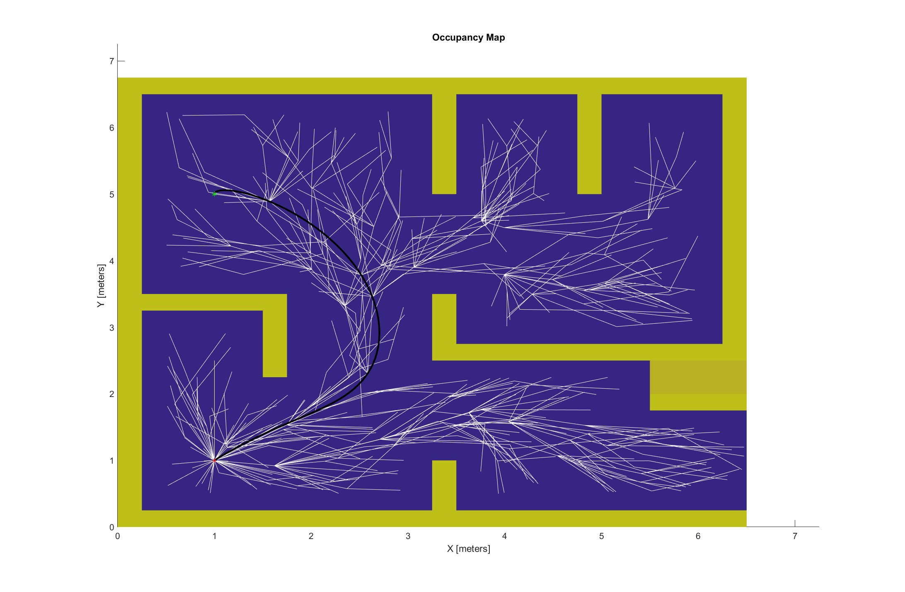

🚁 Quadrotor Nonlinear Control and Planning

This repository contains a project developed for EN530.678.S2022 — Nonlinear Control and Planning in Robotics.
It implements a two-stage PID controller for a quadrotor: the first stage controls position, and the second stage controls attitude to achieve trajectory tracking.
The project also includes a path planner that generates a feasible trajectory, along with visualizations of the quadrotor following the path and the planner’s exploration tree.
---
🧭 Overview

Stage 1 — Position Control:
Computes desired roll, pitch, and yaw commands from position and velocity errors.

Stage 2 — Attitude Control:
Stabilizes the quadrotor’s orientation using PID control for each rotational axis.

Trajectory Tracking:
The system tracks a desired 3D trajectory generated by a planning algorithm.

---

🧩 Features

✅ Two-stage hierarchical PID control
✅ 3D trajectory tracking and stabilization
✅ Path planning and exploration tree visualization
✅ Animated simulation results (GIFs in /figures)
✅ Modular MATLAB implementation

---
📂 Repository Structure
├── Planner/            # Planner and Map generation scripts
├── figures/            # GIFs and figures of simulation results
├── trajectories/       # Trajectory parser and trajectory generation scripts
├── utils/              # Utility and EOM scripts
├── controller.m        # Controller script
├── runsim.m            # Main script
├── simulation_3d.m     # script to visualize the simulation and create the gif
└── README.md           # Project documentation

---

## 🎬 Simulation Results
<p align="center">
  
  
</p>

---

⚙️ Requirements

- MATLAB R2021a or later
- Control System Toolbox
- Curve Fitting Toolbox

---

🚀 Run the Simulation
```bash
# Clone repository and enter folder
git clone https://github.com/yourusername/quadrotor-nonlinear-control.git
cd quadrotor-nonlinear-control

# Open MATLAB, set this folder as the working directory, then run:
# In the MATLAB Command Window:
runsim
```

Generated plots and GIFs will appear in the figures/ folder.

📘 Course Info

Course: EN530.678.S2022 — Nonlinear Control and Planning in Robotics
Institution: Johns Hopkins University

---

✨ Acknowledgments

Thanks to the course instructors and teaching staff for their guidance on nonlinear control and planning techniques.